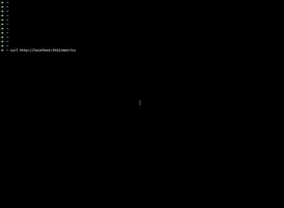

# lazydash [](https://circleci.com/gh/dbnegative/lazydash/tree/master)

Auto generate Grafana dashboards based on prometheus metrics endpoints. Allows for quick prototyping of dashboards. 

# Notes

Version: 0.3.0

* Only Supports Counter and Gauge Types at the moment
* Assumes metrics adhere to prometheus metrics naming conventions and standards e.g:
```
# HELP builder_builds_triggered_total Number of triggered image builds
# TYPE builder_builds_triggered_total counter
builder_builds_triggered_total 0"
```
# Features

* Generate dashboard directly from any prometheus metrics endpoint
* Post generated dashboards directly to Grafana via the API
* Auto panel legend format - will add all labels included in prometheus endpoint to the panel legend format
* Panels use the metrics HELP field as the description
* Override default query expressions and legend formats for metrics types 


---

# Usage

```
usage: lazydash [<flags>]

generate grafana dashboard json from prometheus metrics data via file or by | pipe

Flags:
  -h, --help            Show context-sensitive help (also try --help-long and --help-man).
  -f, --file=""         Parse metrics from file.
  -t, --title="Demo"    Dashboard title
      --stdin           Read from stdin
      --url=""          Fetch Prometheus data from HTTP(S) url
  -p, --pretty          Print pretty indented JSON
  -g, --gauges          Render gauge values as gauge panel type instead of graph
      --table           Render legend as a table
      --set-counter-expr="sum(rate(:METRIC: [1m]))"  
                        Set custom meterics query expression for counter type metric
      --set-gauge-expr=":METRIC:"  
                        Set custom meterics query expression for gauge type metric
      --set-delimiter=":METRIC:"  
                        Set custom meterics delimiter used to insert metric name into expression, only used if a custom expression is set
      --set-counter-legend="Job:[{{job}}]"  
                        Set the default counter panel legend format
      --set-gauge-legend="Job:[{{job}}]"  
                        Set the default counter panel legend format
  -H, --grafana-url=""  Set the grafana api url e.g http://grafana.example.com:3000
  -T, --token=""        Set the grafana api token
      --version         Show application version.
```
---

# Examples

## Pull metric types from prometheus HTTP endpoint and post to the grafana API
```
lazydash -p --url="http://localhost:9323/metrics" -H http://localhost:3000 -T "eyJrIjoiRzRTUGV1a2RWcjgzbklvVzdXenIySEhJWEJlSkx4UksiLCJuIjoidGVzdCIsImlkIjoxfQ==" --table
```
## Override the counter expression and legend format
```
lazydash -p --url=http://localhost:9323/metrics --set-counter-expr="sum(rate(:METRIC: [1m])) by(instance)" --set-counter-legend="Instance:[{{instance}}]"  > dash1.json
```
## Pipe via curl
```
curl -s http://localhost:9323/metrics | lazydash -t "Demo" -p
```
## Use a redirect
```
lazydash < promdata.txt
```
## Using cat
```
cat promdata.txt | lazydash -t "Demo" -p
```
## Using echo
```
echo "# HELP builder_builds_triggered_total Number of triggered image builds \n# TYPE builder_builds_triggered_total counter\nbuilder_builds_triggered_total 0" |lazydash -t "simple dashboard" -p
```
---

# Build and Install 

Requirement: go 1.13

```
go get -u github.com/dbnegative/lazydash
chmod 755 $GOPATH/bin/lazydash
ln -s $GOPATH/bin/lazydash /usr/local/bin/lazydash
```

